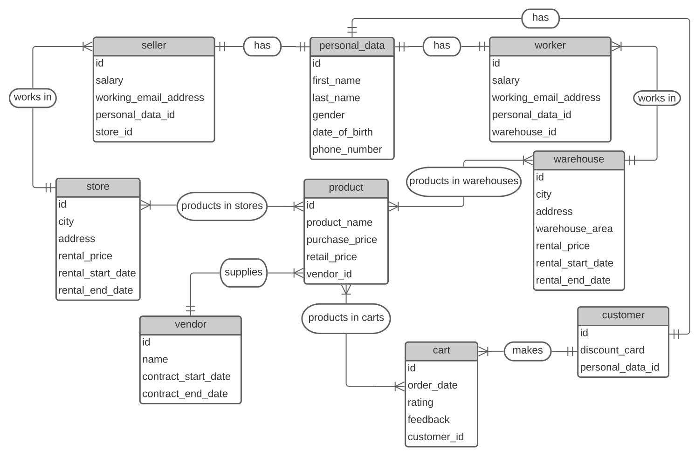
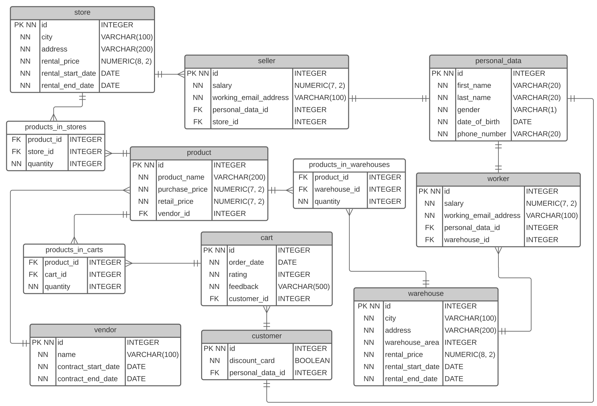

# Лабораторная работа 1.1. Разработка структуры БД

## Цели работы
Познакомиться с основами проектирования схемы БД, способами организации данных в SQL-БД.

## Программа работы
1. Создание проекта для работы в GitLab.
2. Выбор задания (предметной области), описание набора данных и требований к хранимым данным в свободном формате в wiki своего проекта в GitLab.
3. Формирование в свободном формате (предпочтительно в виде графической схемы) cхемы БД, соответствующей заданию. Должно получиться не менее 7 таблиц.
4. Согласование с преподавателем схемы БД. Обоснование принятых решений и соответствия требованиям выбранного задания.
5. Выкладывание схемы БД в свой проект в GitLab.
6. Демонстрация результатов преподавателю.

## Описание БД
В качестве задания было решено реализовать базу данных для сети магазинов спортивных товаров.

**Product** - товар

```
id - идентификатор товара
product_name - наименование товара
purchase_price - цена, за которую покупаем товар у производителя
retail_price - цена, за которую продаём товар покупателю
vendor_id - идентификатор производителя товара
```

**Vendor** - производитель

```
id - идентификатор производителя
name - название производителя
contract_start_date - дата начала контракта
contract_end_date - дата окончания контракта
```

**Cart** - корзина заказа покупателя

```
id - идентификатор заказа
order_date - дата заказа
rating - оценка качества заказа от покупателя (от 1 до 5)
feedback - отзыв покупателя о заказе
customer_id - идентификатор покупателя заказа
```

**Products in carts** - товары в корзинах заказов

```
product_id - идентификатор товара
cart_id - идентификатор корзины заказа
quantity - количество определённого товара в определённом заказе
```

**Customer** - покупатель

```
id - идентификатор покупателя
discount_card - наличие скидочной карты (есть/нет)
personal_data_id - идентификатор персональных данных покупателя
```

**Personal data** - персональные данные

```
id - идентификатор персональных данных
first_name - имя
last_name - фамилия
gender - пол
date_of_birth - дата рождения
phone_number - номер телефона
```

**Store** - магазин

```
id - идентификатор магазина
city - город
address - адрес магазина
rental_price - стоимость аренды
rental_start_date - дата начала аренды
rental_end_date - дата окончания аренды
```

**Products in stores** - товары в магазинах

```
product_id - идентификатор товара
store_id - идентификатор магазина
quantity - количество определённого товара в определённом магазине
```

**Seller** - работник магазина

```
id - идентификатор работника магазина
salary - з/п работника магазина
working_email_address - адрес рабочей почты работника магазина
personal_data_id - идентификатор персональных данных работника магазина
store_id - идентификатор магазина, в котором работает данный работник
```

**Warehouse** - склад

```
id - идентификатор склада
city - город
address - адрес склада
warehouse_area - площадь склада
rental_price - стоимость аренды
rental_start_date - дата начала аренды
rental_end_date - дата окончания аренды
```

**Products in warehouses** - товары на складах

```
product_id - идентификатор товара
warehouse_id - идентификатор склада
quantity - количество определённого товара на определённом складе
```

**Worker** - работник склада

```
id - идентификатор работника склада
salary - з/п работника склада
working_email_address - адрес рабочей почты работника склада
personal_data_id - идентификатор персональных данных работника склада
warehouse_id - идентификатор склада, в котором работает данный работник
```

### Концептуальная модель


### Даталогическая модель


## Вывод
В ходе выполнения данной лабораторной работы был описан набор используемых в моей БД таблиц и их атрибутов. Была выбрана предметная область, составлена концептуальная модель в виде ER-диаграммы. При переходе от концептуальной модели к даталогической то, что было в модели сущность-связь уникальным идентификатором становится первичным ключом; всё, что было связями типа 1 к 1 или 1 ко многим преобразуется во внешний ключ; связь многих ко многим преобразуется в дополнительную таблицу. Также для всех атрибутов были указаны соответствующие типы данных.
