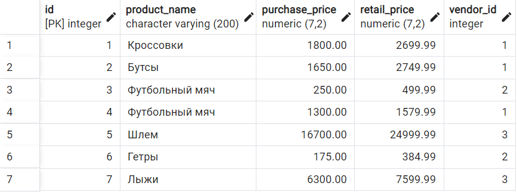
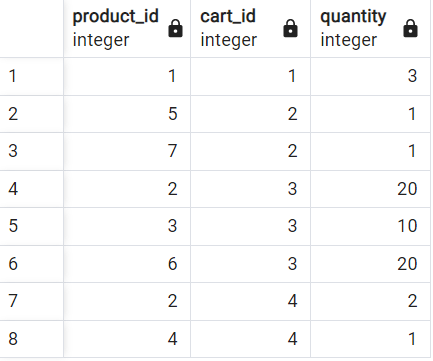
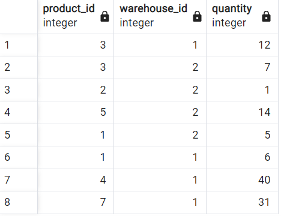

# Лабораторная работа 1.2. Язык SQL DDL

## Цели работы
Познакомиться с основами проектирования схемы БД, языком описания сущностей и ограничений БД SQL-DDL.

## Программа работы
1. Самостоятельное изучение SQL-DDL.
2. Создание скрипта БД в соответствии с согласованной схемой. Должны присутствовать первичные и внешние ключи, ограничения на диапазоны значений. Демонстрация скрипта преподавателю.
3. Создание скрипта, заполняющего все таблицы БД данными.
4. Выполнение SQL-запросов, изменяющих схему созданной БД по заданию преподавателя. Демонстрация их работы преподавателю.

## Язык SQL
Язык SQL (Structured Query Language) - язык структурированных запросов. Он позволяет формировать весьма сложные запросы к базам данных. В SQL определены два подмножества языка:
- SQL-DDL (Data Definition Language) - язык определения структур и ограничений целостности баз данных. Сюда относятся команды создания и удаления баз данных; создания, изменения и удаления таблиц; управления пользователями и т.д.
- SQL-DML (Data Manipulation Language) - язык манипулирования данными: добавление, изменение, удаление и извлечение данных, управления транзакциями

## Ход работы
Был создан скрипт БД в соответствии с согласованной схемой, в котором присутствует первичные и внешние ключи, ограничения на диапазоны значений. Для установления связи между таблицами, после ключевого слова REFERENCES указывается имя связанной таблицы и далее в скобках имя столбца из этой таблицы, на который указывает внешний ключ. Также были добавлены ограничения на диапазоны некоторых значений.

Мной были использованы следующие типы данных:
- VARCHAR(n) - символьная строка переменной длины. Для хранения данных этого типа отводится число байт, соответствующее реальной длине строки.
- INTEGER - обычное целое число (4 байта).
- NUMERIC(p,n) - тип данных аналогичный FLOAT с числом значащих цифр p и точностью n.
- DATE - тип данных для хранения даты.
- BOOLEAN - логический тип данных. Поддерживает значения TRUE и FALSE.

### Создание таблиц и их заполнение

**Vendor** - производитель

```
CREATE TABLE vendor (
	id INTEGER NOT NULL PRIMARY KEY,
	name VARCHAR(100) NOT NULL,
	contract_start_date DATE NOT NULL,
	contract_end_date DATE NOT NULL,
	CONSTRAINT dates_check CHECK (contract_start_date < contract_end_date)
);

INSERT INTO vendor
	(id, name,
	 contract_start_date, contract_end_date)
VALUES
	(1, 'Nike', '2020-01-01', '2023-01-01'),
	(2, 'Demix', '2019-06-01', '2024-06-01'),
	(3, 'Reaction', '2021-04-03', '2022-10-03');
```


**Product** - товар

```
CREATE TABLE product (
	id INTEGER NOT NULL PRIMARY KEY,
	product_name VARCHAR(200) NOT NULL,
	purchase_price NUMERIC(7, 2) NOT NULL,
	retail_price NUMERIC(7, 2) NOT NULL,
	vendor_id INTEGER REFERENCES vendor(id)
);

INSERT INTO product
	(id, product_name, purchase_price,
	 retail_price, vendor_id)
VALUES
	(1, 'Кроссовки', 1800.00, 2699.99, 1),
	(2, 'Бутсы', 1650.00, 2749.99, 1),
	(3, 'Футбольный мяч', 250.00, 499.99, 2),
	(4, 'Футбольный мяч', 1300.00, 1579.99, 1),
	(5, 'Шлем', 16700.00, 24999.99, 3),
	(6, 'Гетры', 175.00, 384.99, 2),
	(7, 'Лыжи', 6300.00, 7599.99, 3);

```



**Personal data** - персональные данные

```
CREATE TABLE personal_data (
	id INTEGER NOT NULL PRIMARY KEY,
	first_name VARCHAR(20) NOT NULL,
	last_name VARCHAR(20) NOT NULL,
	gender VARCHAR(1) NOT NULL,
	date_of_birth DATE NOT NULL,
	phone_number VARCHAR(20) NOT NULL,
	CONSTRAINT gender_check CHECK (gender = 'М' OR gender = 'Ж')
);

INSERT INTO personal_data
	(id, first_name, last_name,
	 gender, date_of_birth, phone_number)
VALUES
	(1, 'Иван', 'Иванов', 'М', '1992-02-21', '+7 (900) 000-00-00'),
	(2, 'Александра', 'Петрова', 'Ж', '2001-01-01', '+7 (911) 222-00-00'),
	(3, 'Сергей', 'Сидоров', 'М', '1989-06-16', '8 (903) 300-00-00'),
	(4, 'Ирина', 'Максимова', 'Ж', '1996-11-04', '+7 (913) 224-40-00');
```


**Customer** - покупатель

```
CREATE TABLE customer (
	id INTEGER NOT NULL PRIMARY KEY,
	discount_card BOOLEAN NOT NULL,
	personal_data_id INTEGER REFERENCES personal_data(id)
);

INSERT INTO customer
	(id, discount_card,
	 personal_data_id)
VALUES
	(1, TRUE, 1),
	(2, FALSE, 3),
	(3, TRUE, 4);
```


**Cart** - корзина заказа покупателя

```
CREATE TABLE cart (
	id INTEGER NOT NULL PRIMARY KEY,
	order_date DATE NOT NULL,
	rating INTEGER NOT NULL,
	feedback VARCHAR(500) NOT NULL,
	customer_id INTEGER REFERENCES customer(id),
	CONSTRAINT rating_check CHECK (rating >= 1 AND rating <= 5)
);

INSERT INTO cart
	(id, order_date, rating,
	 feedback, customer_id)
VALUES
	(1, '2022-08-08', 5, 'Отлично', 1),
	(2, '2022-08-11', 1, 'Ужасно', 1),
	(3, '2022-08-14', 3, 'Так себе', 2),
	(4, '2022-08-20', 4, 'Хорошо', 3);
```


**Products in carts** - товары в корзинах заказов

```
CREATE TABLE products_in_carts (
	product_id INTEGER REFERENCES product(id),
	cart_id INTEGER REFERENCES cart(id),
	quantity INTEGER NOT NULL
);

INSERT INTO products_in_carts
	(product_id, cart_id, quantity)
VALUES
	(1, 1, 3),
	(5, 2, 1),
	(7, 2, 1),
	(2, 3, 20),
	(3, 3, 10),
	(6, 3, 20),
	(2, 4, 2),
	(4, 4, 1);
```



**Store** - магазин

```
CREATE TABLE store (
	id INTEGER NOT NULL PRIMARY KEY,
	city VARCHAR(100) NOT NULL,
	address VARCHAR(200) NOT NULL,
	rental_price NUMERIC(8, 2) NOT NULL,
	rental_start_date DATE NOT NULL,
	rental_end_date DATE NOT NULL,
	CONSTRAINT dates_check CHECK (rental_start_date < rental_end_date)
);

INSERT INTO store
	(id, city, address, rental_price,
	 rental_start_date, rental_end_date)
VALUES
	(1, 'Санкт-Петербург', 'ул. Первая, д.1', 80000.00, '2021-01-01', '2024-01-01'),
	(2, 'Москва', 'ул. Вторая, д.2', 100000.00, '2022-02-02', '2024-08-02');
```


**Products in stores** - товары в магазинах

```
CREATE TABLE products_in_stores (
	product_id INTEGER REFERENCES product(id),
	store_id INTEGER REFERENCES store(id),
	quantity INTEGER NOT NULL
);

INSERT INTO products_in_stores
	(product_id, store_id, quantity)
VALUES
	(1, 1, 10),
	(1, 2, 4),
	(2, 2, 1),
	(2, 2, 8),
	(3, 2, 5),
	(4, 1, 40),
	(6, 1, 24);
```


**Seller** - работник магазина

```
CREATE TABLE seller (
	id INTEGER NOT NULL PRIMARY KEY,
	salary NUMERIC(7, 2) NOT NULL,
	working_email_address VARCHAR(100) NOT NULL,
	personal_data_id INTEGER REFERENCES personal_data(id),
	store_id INTEGER REFERENCES store(id)
);

INSERT INTO seller
	(id, salary, working_email_address,
	 personal_data_id, store_id)
VALUES
	(1, 30000.00, 'ivan_ivanov@mail.ru', 1, 1),
	(2, 45000.00, 'irina_maximova@gmail.com', 4, 2);
```


**Warehouse** - склад

```
CREATE TABLE warehouse (
	id INTEGER NOT NULL PRIMARY KEY,
	city VARCHAR(100) NOT NULL,
	address VARCHAR(200) NOT NULL,
	warehouse_area INTEGER NOT NULL,
	rental_price NUMERIC(8, 2) NOT NULL,
	rental_start_date DATE NOT NULL,
	rental_end_date DATE NOT NULL,
	CONSTRAINT dates_check CHECK (rental_start_date < rental_end_date)
);

INSERT INTO warehouse
	(id, city, address,
	 warehouse_area, rental_price,
	 rental_start_date, rental_end_date)
VALUES
	(1, 'Санкт-Петербург', 'ул. Cкладская, стр.1', 500, 70000.00, '2021-01-01', '2024-01-01'),
	(2, 'Москва', 'пр-кт Складов, стр.2', 2300, 130000.00, '2022-02-02', '2024-08-02');
```


**Products in warehouses** - товары на складах

```
CREATE TABLE products_in_warehouses (
	product_id INTEGER REFERENCES product(id),
	warehouse_id INTEGER REFERENCES warehouse(id),
	quantity INTEGER NOT NULL
);

INSERT INTO products_in_warehouses
	(product_id, warehouse_id, quantity)
VALUES
	(3, 1, 12),
	(3, 2, 7),
	(2, 2, 1),
	(5, 2, 14),
	(1, 2, 5),
	(1, 1, 6),
	(4, 1, 40),
	(7, 1, 31);
```



**Worker** - работник склада

```
CREATE TABLE worker (
	id INTEGER NOT NULL PRIMARY KEY,
	salary NUMERIC(7, 2) NOT NULL,
	working_email_address VARCHAR(100) NOT NULL,
	personal_data_id INTEGER REFERENCES personal_data(id),
	warehouse_id INTEGER REFERENCES warehouse(id)
);

INSERT INTO worker
	(id, salary, working_email_address,
	 personal_data_id, warehouse_id)
VALUES
	(1, 20000.00, 'ivan_ivanov@mail.ru', 1, 1),
	(2, 15000.00, 'alexandra_petrova@gmail.com', 2, 2);
```


## Вывод
В ходе выполнения лабораторной работы на практике были изучены основы работы с SQL-DDL и SQL-DML. С использованием SQL-запросов был написан скрипт создающий БД. Для создания таблиц был использован оператор CREATE TABLE, а для заполнения таблиц данными - оператор INSERT INTO.
