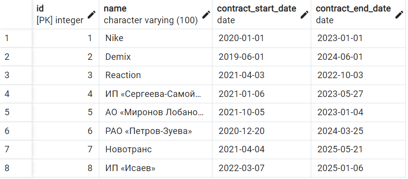
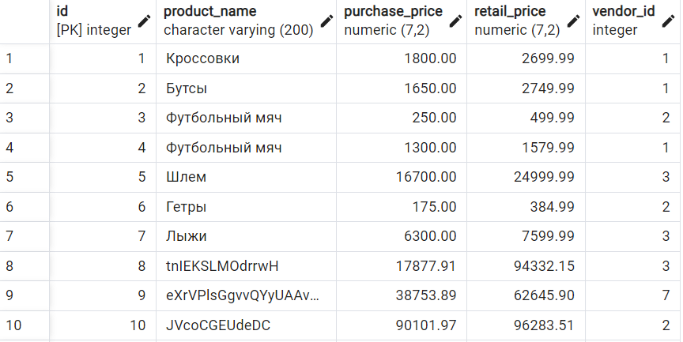
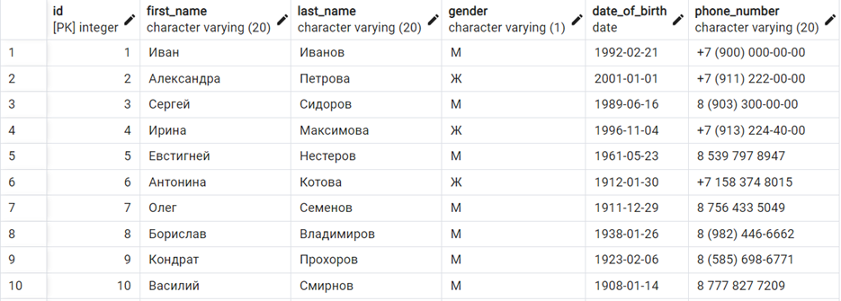
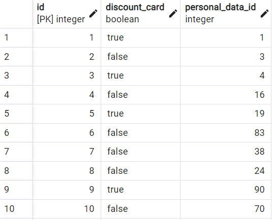
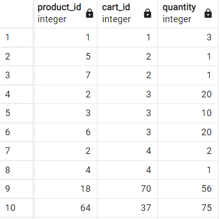
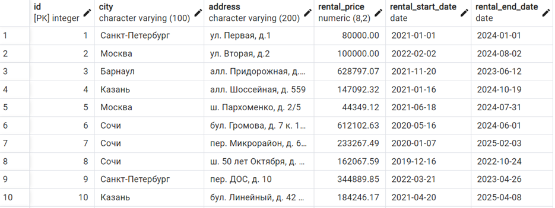
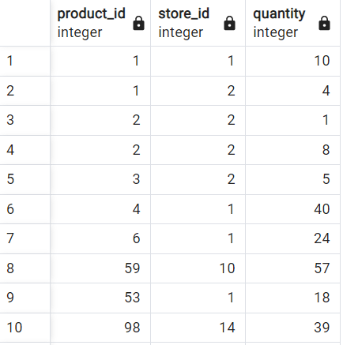
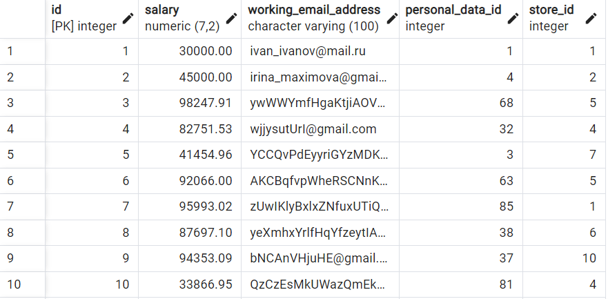
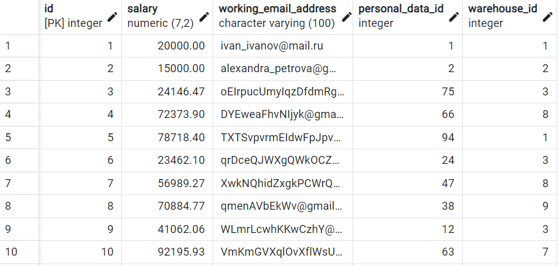

# Лабораторная работа 2. Генерация тестовых данных

## Цели работы
Сформировать набор данных, позволяющий производить операции на реальных объемах данных.

## Программа работы
1. Реализация в виде программы параметризуемого генератора, который позволит сформировать набор связанных данных в каждой таблице.
2. Частные требования к генератору, набору данных и результирующему набору данных:
- количество записей в справочных таблицах должно соответствовать ограничениям предметной области
- количество записей в таблицах, хранящих информацию об объектах или субъектах должно быть параметром генерации
- значения для внешних ключей необходимо брать из связанных таблиц
- сохранение уже имеющихся данных в базе данных

## Ход работы
При генерации тестовых данных часть из них была взята из готовых словарей (была использована библиотека faker для Python), другая часть была сгенерирована специально написанными функциями рандомно. В качестве адаптера PostgreSQL был выбран psycopg2 для Python.

### Заполнение таблиц тестовыми данными

**Vendor** - производитель

```
names = set()
while len(names) < 5:
    names.add(fake.company())

for id in range(4, 4 + len(names)):
    name = names.pop()
    contract_start_date = fake.past_date(start_date="-3y")
    contract_end_date = fake.future_date(end_date="+3y")

    cur.execute("INSERT INTO vendor "
                "(id, name, contract_start_date, contract_end_date) "
                "VALUES (%s, %s, %s, %s);",
                (id, name, contract_start_date, contract_end_date))

conn.commit()
```



Были сгенерированы ещё 5 производителей, у каждого уникальное название. Для данной таблицы было учтено органичение наложенное на поля contract_start_date и contract_end_date (contract_start_date < contract_end_date).

**Product** - товар

```
for id in range(8, 101):
    product_name = fake.pystr(min_chars=8, max_chars=30)
    purchase_price = round(random.uniform(0.01, 99999.00), 2)
    retail_price = round(random.uniform(purchase_price + 0.01, 99999.99), 2)
    vendor_id = random.randint(1, 8)

    cur.execute("INSERT INTO product "
                "(id, product_name, purchase_price, retail_price, vendor_id) "
                "VALUES (%s, %s, %s, %s, %s);",
                (id, product_name, purchase_price, retail_price, vendor_id))

conn.commit()
```



Были сгенерированы ещё 93 товара. При генерации было учтено, что цена, за которую мы покупаем товар у производителя (purchase_price), должна быть меньше, чем цена, за которую мы продаём товар покупателю (retail_price).

**Personal data** - персональные данные

```
for id in range(5, 101):
    gender = fake.random.choice(["М", "Ж"])
    if gender == "М":
        first_name = fake.first_name_male()
        last_name = fake.last_name_male()
    else:
        first_name = fake.first_name_female()
        last_name = fake.last_name_female()
    date_of_birth = fake.date_of_birth()
    phone_number = fake.phone_number()
    
    cur.execute("INSERT INTO personal_data "
                "(id, first_name, last_name, gender, date_of_birth, phone_number) "
                "VALUES (%s, %s, %s, %s, %s, %s);", 
                (id, first_name, last_name, gender, date_of_birth, phone_number))

conn.commit()
```



Были сгенерированы ещё 96 наборов персональных данных. При генерации было учтено, что пол и имя с фамилией должны соответствовать.

**Customer** - покупатель

```
cur.execute("SELECT personal_data_id FROM customer;")
conn.commit()

pd_ids = set()
for pd_id in cur.fetchall():
    pd_ids.add(pd_id[0])

for id in range(4, 21):
    discount_card = bool(random.getrandbits(1))

    personal_data_id = random.randint(1, 100)
    while personal_data_id in pd_ids:
        personal_data_id = random.randint(1, 100)
    pd_ids.add(personal_data_id)

    cur.execute("INSERT INTO customer "
                "(id, discount_card, personal_data_id) "
                "VALUES (%s, %s, %s);",
                (id, discount_card, personal_data_id))

conn.commit()
```



Были сгенерированы ещё 17 покупателей. Было учтено, что одни персональные данные могут соответствовать только одному покупателю.

**Cart** - корзина заказа покупателя

```
for id in range(5, 101):
    order_date = fake.past_date(start_date="-3y")
    rating = random.randint(1, 5)
    feedback = fake.text(max_nb_chars=250).replace("\n", " ")
    customer_id = random.randint(1, 20)

    cur.execute("INSERT INTO cart "
                "(id, order_date, rating, feedback, customer_id) "
                "VALUES (%s, %s, %s, %s, %s);",
                (id, order_date, rating, feedback, customer_id))

conn.commit()
```


Были сгенерированы ещё 96 корзин заказов.

**Products in carts** - товары в корзинах заказов

```
products_in_carts = np.zeros(10000, dtype=int).reshape(100, 100)

cur.execute("SELECT * FROM products_in_carts;")
conn.commit()

for product_cart in cur.fetchall():
    products_in_carts[product_cart[0] - 1][product_cart[1] - 1] = product_cart[2]

for id in range(9, 101):
    product_id = random.randint(1, 100)
    cart_id = random.randint(1, 100)
    quantity = random.randint(1, 100)

    while products_in_carts[product_id - 1][cart_id - 1] != 0:
        product_id = random.randint(1, 100)
        cart_id = random.randint(1, 100)

    products_in_carts[product_id - 1][cart_id - 1] = quantity

    cur.execute("INSERT INTO products_in_carts "
                "(product_id, cart_id, quantity) "
                "VALUES (%s, %s, %s);",
                (product_id, cart_id, quantity))

conn.commit()
```



Были добавлены ещё 92 продукта в разные корзины заказов. Было учтено, что один и тот же продукт не может быть добавлен в одну и ту же корзину два раза.

**Store** - магазин

```
for id in range(3, 16):
    city = fake.random.choice(["Санкт-Петербург", "Москва", "Сочи", "Казань", "Барнаул"])
    address = fake.street_address()
    rental_price = round(random.uniform(10000.00, 999999.99), 2)
    rental_start_date = fake.past_date(start_date="-3y")
    rental_end_date = fake.future_date(end_date="+3y")

    cur.execute("INSERT INTO store "
                "(id, city, address, rental_price, rental_start_date, rental_end_date) "
                "VALUES (%s, %s, %s, %s, %s, %s);",
                (id, city, address, rental_price, rental_start_date, rental_end_date))

conn.commit()
```



Были сгенерированы ещё 13 магазинов. Так как fake.city() часто вместо крупных городов генерировал всякие колхозы и деревни, было принято решение о том, чтобы город выбирался случайным образом из пяти предложенных мной вариантов с помощью функции fake.random.choice(). Было учтено органичение наложенное на поля rental_start_date и rental_end_date (rental_start_date < rental_end_date).

**Products in stores** - товары в магазинах

```
products_in_stores = np.zeros(1500, dtype=int).reshape(100, 15)

cur.execute("SELECT * FROM products_in_stores;")
conn.commit()

for product_store in cur.fetchall():
    products_in_stores[product_store[0] - 1][product_store[1] - 1] = product_store[2]

for id in range(8, 101):
    product_id = random.randint(1, 100)
    store_id = random.randint(1, 15)
    quantity = random.randint(1, 100)

    while products_in_stores[product_id - 1][store_id - 1] != 0:
        product_id = random.randint(1, 100)
        store_id = random.randint(1, 15)

    products_in_stores[product_id - 1][store_id - 1] = quantity

    cur.execute("INSERT INTO products_in_stores "
                "(product_id, store_id, quantity) "
                "VALUES (%s, %s, %s);",
                (product_id, store_id, quantity))

conn.commit()
```



Были добавлены ещё 93 продукта в разные магазины. Было учтено, что один и тот же продукт не может быть добавлен в один и тот же магазин два раза.

**Seller** - работник магазина

```
cur.execute("SELECT personal_data_id FROM seller;")
conn.commit()

pd_ids = set()
for pd_id in cur.fetchall():
    pd_ids.add(pd_id[0])

for id in range(3, 31):
    salary = round(random.uniform(10000.00, 99999.99), 2)
    working_email_address = fake.pystr(min_chars=8, max_chars=30) + fake.random.choice(["@mail.ru", "@gmail.com"])

    personal_data_id = random.randint(1, 100)
    while personal_data_id in pd_ids:
        personal_data_id = random.randint(1, 100)
    pd_ids.add(personal_data_id)

    store_id = random.randint(1, 15)

    cur.execute("INSERT INTO seller "
                "(id, salary, working_email_address, personal_data_id, store_id) "
                "VALUES (%s, %s, %s, %s, %s);",
                (id, salary, working_email_address, personal_data_id, store_id))

conn.commit()
```



Были сгенерированы ещё 28 работников магазинов. Было учтено, что одни персональные данные могут соответствовать только одному работнику магазина. При генерации почты не была использована функция fake.email(), так как в сгенерированных почтах часто присутствовали имена и фамилии, поэтому было решено генерировать почту, состоящую из случайного набора латинских букв.

**Warehouse** - склад

```
for id in range(3, 16):
    city = fake.random.choice(["Санкт-Петербург", "Москва", "Сочи", "Казань", "Барнаул"])
    address = fake.street_address()
    warehouse_area = divmod(random.randint(300, 10000), 100)[0] * 100
    rental_price = round(random.uniform(10000.00, 999999.99), 2)
    rental_start_date = fake.past_date(start_date="-3y")
    rental_end_date = fake.future_date(end_date="+3y")

    cur.execute("INSERT INTO warehouse "
                "(id, city, address, warehouse_area, rental_price, rental_start_date, rental_end_date) "
                "VALUES (%s, %s, %s, %s, %s, %s, %s);",
                (id, city, address, warehouse_area, rental_price, rental_start_date, rental_end_date))

conn.commit()
```


Были сгенерированы ещё 13 складов. Так как fake.city() часто вместо крупных городов генерировал всякие колхозы и деревни, было принято решение о том, чтобы город выбирался случайным образом из пяти предложенных мной вариантов с помощью функции fake.random.choice(). Было учтено органичение наложенное на поля rental_start_date и rental_end_date (rental_start_date < rental_end_date).

Также в отличии от магазина у склада есть поле warehouse_area, с помощью которого можно без проблем определить сколько денег отдаётся за единицу объёма склада.

**Products in warehouses** - товары на складах

```
products_in_warehouses = np.zeros(1500, dtype=int).reshape(100, 15)

cur.execute("SELECT * FROM products_in_warehouses;")
conn.commit()

for product_warehouse in cur.fetchall():
    products_in_warehouses[product_warehouse[0] - 1][product_warehouse[1] - 1] = product_warehouse[2]

for id in range(9, 101):
    product_id = random.randint(1, 100)
    warehouse_id = random.randint(1, 15)
    quantity = random.randint(1, 100)

    while products_in_warehouses[product_id - 1][warehouse_id - 1] != 0:
        product_id = random.randint(1, 100)
        warehouse_id = random.randint(1, 15)

    products_in_warehouses[product_id - 1][warehouse_id - 1] = quantity

    cur.execute("INSERT INTO products_in_warehouses "
                "(product_id, warehouse_id, quantity) "
                "VALUES (%s, %s, %s);",
                (product_id, warehouse_id, quantity))

conn.commit()
```


Были добавлены ещё 92 продукта в разные склады. Было учтено, что один и тот же продукт не может быть добавлен в один и тот же склад два раза.

**Worker** - работник склада

```
cur.execute("SELECT personal_data_id FROM worker;")
conn.commit()

pd_ids = set()
for pd_id in cur.fetchall():
    pd_ids.add(pd_id[0])

for id in range(3, 31):
    salary = round(random.uniform(10000.00, 99999.99), 2)
    working_email_address = fake.pystr(min_chars=8, max_chars=30) + fake.random.choice(["@mail.ru", "@gmail.com"])

    personal_data_id = random.randint(1, 100)
    while personal_data_id in pd_ids:
        personal_data_id = random.randint(1, 100)
    pd_ids.add(personal_data_id)

    warehouse_id = random.randint(1, 15)

    cur.execute("INSERT INTO worker "
                "(id, salary, working_email_address, personal_data_id, warehouse_id) "
                "VALUES (%s, %s, %s, %s, %s);",
                (id, salary, working_email_address, personal_data_id, warehouse_id))

conn.commit()
```



Были сгенерированы ещё 28 работников складов. Было учтено, что одни персональные данные могут соответствовать только одному работнику склада. При генерации почты не была использована функция fake.email(), так как в сгенерированных почтах часто присутствовали имена и фамилии, поэтому было решено генерировать почту, состоящую из случайного набора латинских букв.

## Вывод
В ходе данной лабораторной работы были сгенерированы тестовые данные для таблиц БД, созданных в лабораторной работе 1.2. Программа-генератор была написана на языке Python с использованием psycopg2. Для того чтобы генерируемые данные представляли из себя не просто набор символов, а в достаточной мере соответствовали нашим ожиданиям была использована библиотека faker. При этом были учтены ограничения, накладываемые связями полей между собой.
