# Лабораторная работа 3. Язык SQL DML

## Цели работы
Познакомить студентов с языком создания запросов управления данными SQL-DML.

## Программа работы
1. Изучение SQL-DML.
2. Выполнение всех запросов из списка стандартных запросов. Демонстрация результатов преподавателю.
3. Получение у преподавателя и реализация SQL-запросов в соответствии с индивидуальным заданием. Демонстрация результатов преподавателю.
4. Сохранение в БД выполненных запросов SELECT в виде представлений, запросов INSERT, UPDATE или DELETE - в виде ХП. Выкладывание скрипта в GitLab.

## Ход работы

### Выполнение стандартных запросов

- Выборка всех данных из каждой таблицы

```
SELECT * FROM vendor;
```

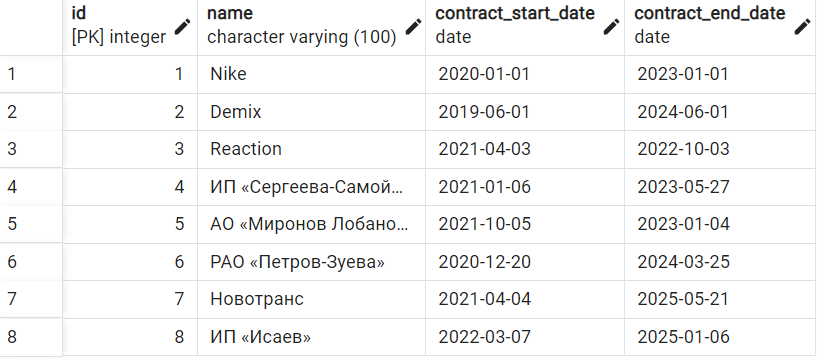

```
SELECT * FROM product;
```

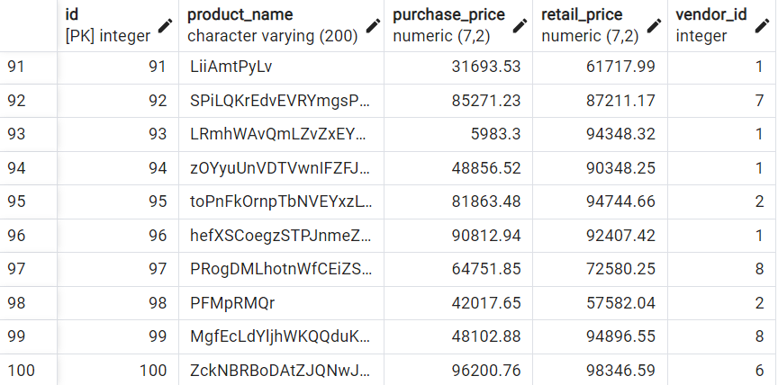

```
SELECT * FROM personal_data;
```

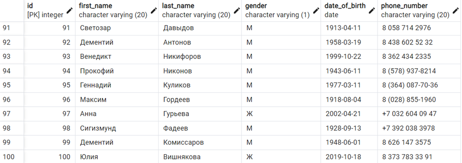

```
SELECT * FROM customer;
```

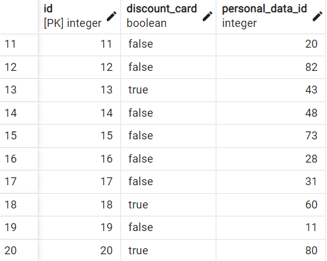

```
SELECT * FROM cart;
```

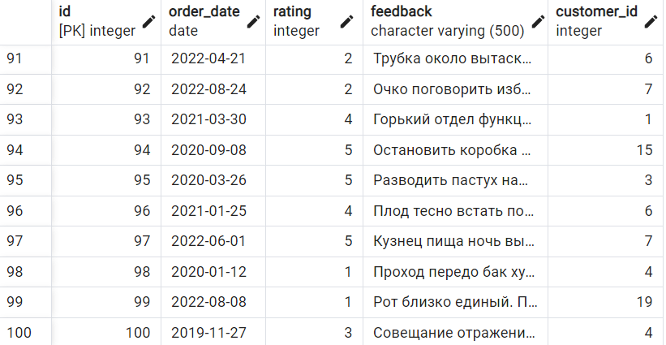

```
SELECT * FROM products_in_carts;
```

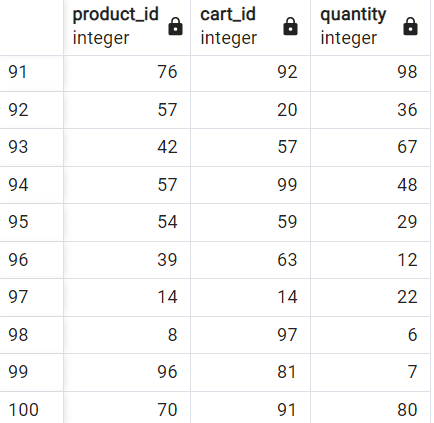

```
SELECT * FROM store;
```

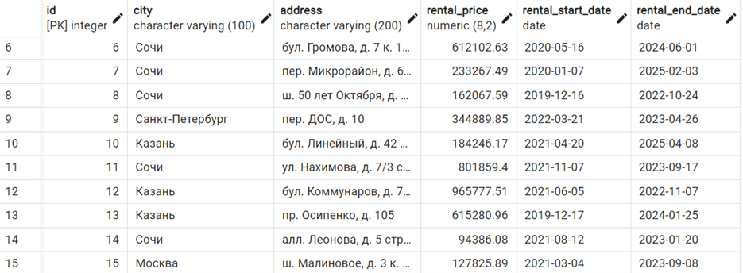

```
SELECT * FROM products_in_stores;
```

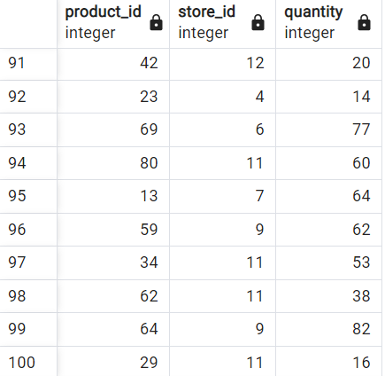

```
SELECT * FROM seller;
```

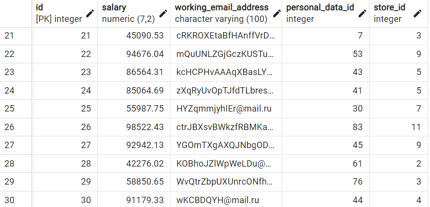

```
SELECT * FROM warehouse;
```

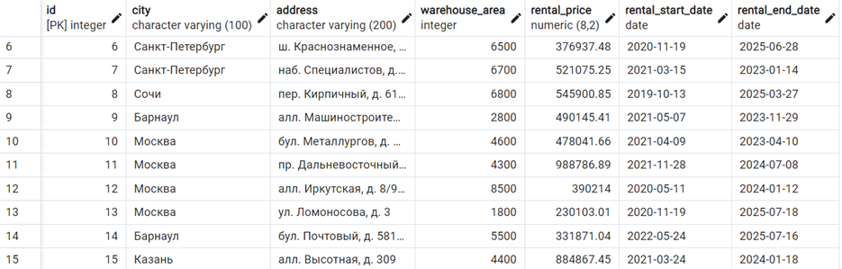

```
SELECT * FROM products_in_warehouses;
```

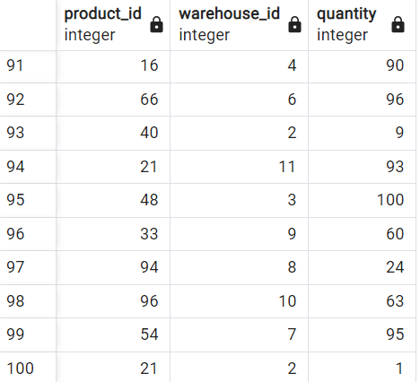

```
SELECT * FROM worker;
```

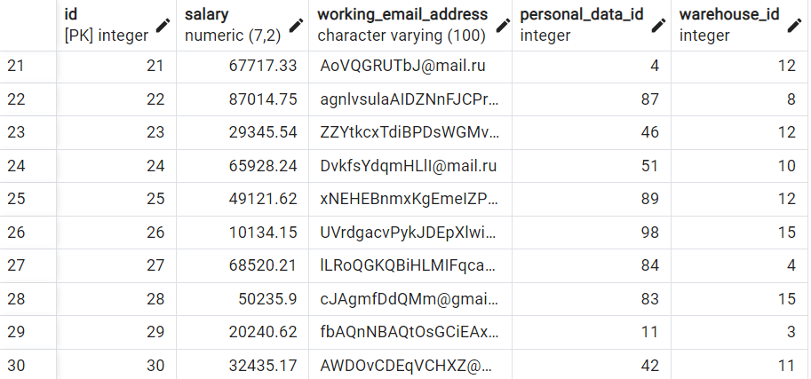

- Выборка данных из одной таблицы при нескольких условиях, с использованием логических операций LIKE, BETWEEN, IN

```
SELECT * FROM warehouse
	WHERE city LIKE '%Санкт-Петербург%';
```

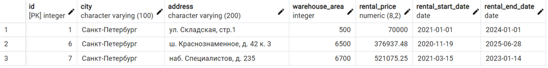

Были выведены данные о складах, располагающихся в Санкт-Петербурге.

```
SELECT * FROM warehouse
	WHERE rental_end_date BETWEEN '2023-01-01' AND '2023-12-31';
```

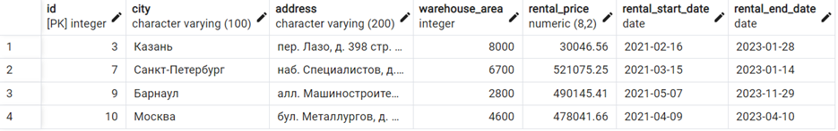

Были выведены данные о складах, аренда которых заканчивается в 2023 году.

```
SELECT * FROM warehouse
	WHERE id IN (1, 8, 13);
```

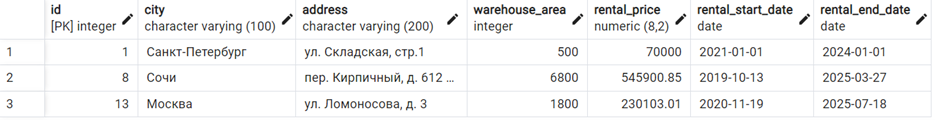

Были выведены данные о складах, имеющих перечисленные идентификаторы.

- Запрос с вычисляемым полем

```
SELECT id, city, address, rental_price / warehouse_area as price_per_unit_area_of_warehouse
	FROM warehouse;
```

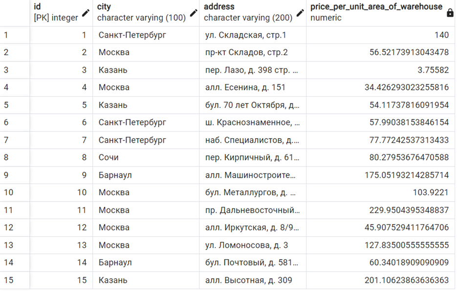

Было создано вычисляемое поле price_per_unit_area_of_warehouse - цена за аренду единицы площади склада. Значение данного поля определяется отношением rental_price к warehouse_area.

- Выборка всех данных с сортировкой по нескольким полям

```
SELECT * FROM seller
	ORDER BY store_id ASC, salary DESC;
```


В отсортированном виде выведены данные о работниках магазинов. Полученные записи отсортированы по возрастанию идентификатора магазина и по убыванию зарплаты работников.

- Запрос, вычисляющий несколько совокупных характеристик таблиц

```
SELECT * FROM product
	WHERE vendor_id = 4;
```

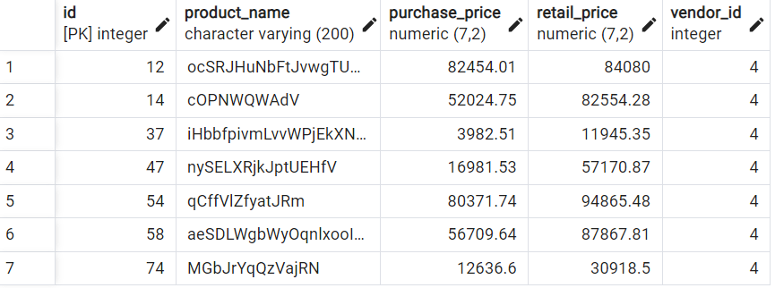

Для товаров от производителя с id = 4 были посчитаны значения агрегатных функций AVG, MAX и MIN для retail_price - цены, за которую товар продаётся покупателям. Кроме этого было подсчитано количество товаров от производителя с id = 4 с помощью функции COUNT.

```
SELECT AVG(retail_price) as average_retail_price, MAX(retail_price) as max_retail_price,
	MIN(retail_price) as min_retail_price, COUNT(*) as number_of_products FROM product
		WHERE vendor_id = 4;
```

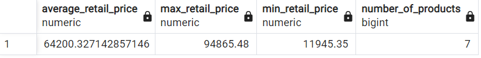

- Выборка данных из связанных таблиц

```
SELECT product.product_name, vendor.name, product.purchase_price FROM product
	INNER JOIN vendor ON product.vendor_id = vendor.id;
```

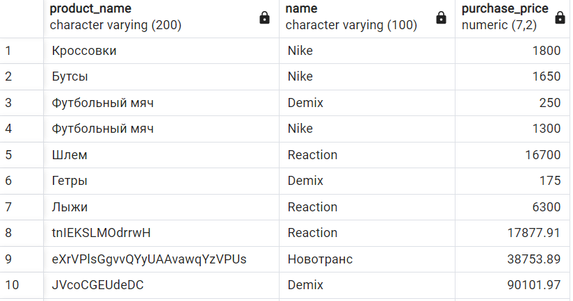

В результате соединения таблиц product и vendor была получена выборка, содержащая в себе названия товаров, соответствующие им названия производителей и стоимость, за которую товары были приобретены у производителя.

```
SELECT personal_data.first_name, personal_data.last_name,
	worker.salary, warehouse.city FROM worker
		INNER JOIN personal_data ON worker.personal_data_id = personal_data.id
			INNER JOIN warehouse ON worker.warehouse_id = warehouse.id;
```

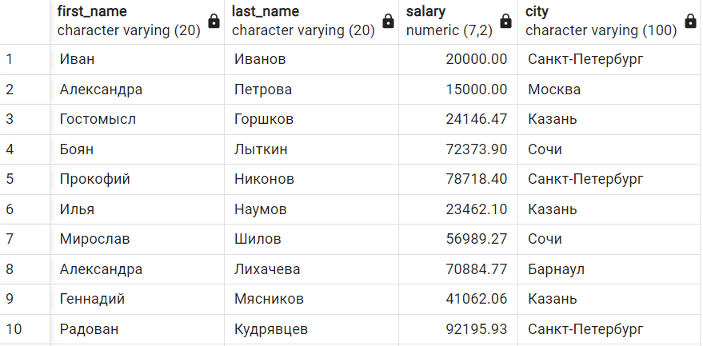

В результате соединения таблиц worker, personal_data и warehouse была получена выборка, содержащая в себе имена и фамилии работников склада, их зарплаты и города, в которых они работают.

- Запрос, рассчитывающий совокупную характеристику с использованием группировки, с последующим наложением ограничения на результат группировки

```
SELECT warehouse_id, COUNT(*) as number_of_workers FROM worker
	GROUP BY warehouse_id
		ORDER BY number_of_workers DESC;
```

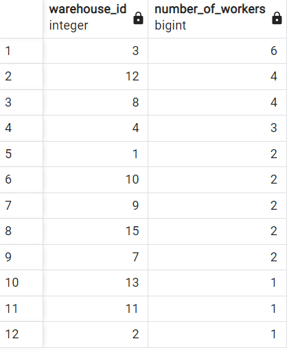

В качестве совокупной характеристики был выбран подсчёт количества сотрудников работающих на конкретном складе.

Было наложено ограничение на результат группировки, а именно были выведены данные только о тех складах, на которых работают не менее трёх сотрудников.

```
SELECT warehouse_id, COUNT(*) as number_of_workers FROM worker
	GROUP BY warehouse_id
		HAVING COUNT(*) >= 3
			ORDER BY number_of_workers DESC;
```

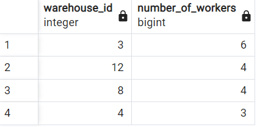

- Использование вложенного запроса

```
SELECT * FROM cart
	WHERE cart.customer_id IN
		(SELECT customer.id FROM customer
			WHERE customer.discount_card = true);
```

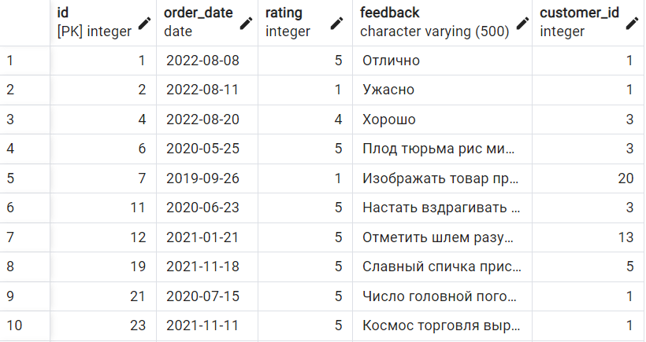

Результатом выборки для вложенного подзапроса является набор идентификаторов покупателей, у которых есть скидочная карта. В результате выполнения внешнего запроса были выведены данные о корзинах заказов таких покупателей.

- Добавление с помощью оператора INSERT в каждую таблицу по одной записи

```
INSERT INTO vendor
	(id, name, contract_start_date, contract_end_date)
VALUES
	(9, 'Adidas', '2022-09-10', '2024-09-10');
```

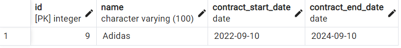

```
INSERT INTO product
	(id, product_name, purchase_price, retail_price, vendor_id)
VALUES
	(101, 'Баскетбольный мяч', 1300.00, 1699.99, 2);
```

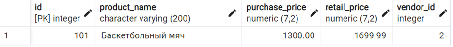

```
INSERT INTO personal_data
	(id, first_name, last_name, gender, date_of_birth, phone_number)
VALUES
	(101, 'Пётр', 'Петров', 'М', '2000-04-11', '8 900 123 00 00');
```


```
INSERT INTO customer
	(id, discount_card, personal_data_id)
VALUES
	(21, FALSE, 100);
```

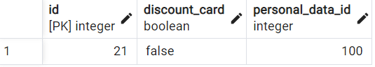

```
INSERT INTO cart
	(id, order_date, rating, feedback, customer_id)
VALUES
	(101, '2022-09-10', 5, 'Супер', 20);
```

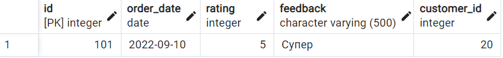

```
INSERT INTO products_in_carts
	(product_id, cart_id, quantity)
VALUES
	(100, 100, 2);
```

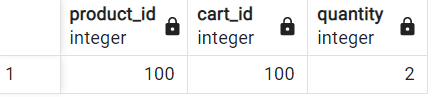

```
INSERT INTO store
	(id, city, address, rental_price, rental_start_date, rental_end_date)
VALUES
	(16, 'Казань', 'ул. Третья, д.3', 80000.00, '2022-09-10', '2023-09-10');
```

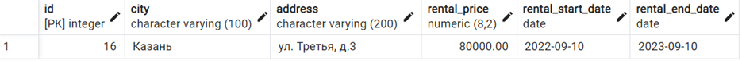

```
INSERT INTO products_in_stores
	(product_id, store_id, quantity)
VALUES
	(100, 15, 2);
```

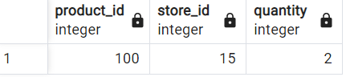

```
INSERT INTO seller
	(id, salary, working_email_address, personal_data_id, store_id)
VALUES
	(31, 40000.00, 'AbCdeF@mail.ru', 100, 15);
```

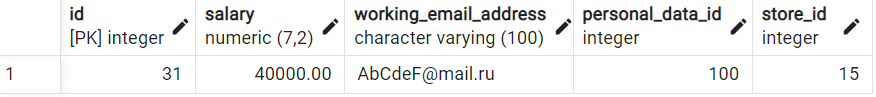

```
INSERT INTO warehouse
	(id, city, address, warehouse_area, rental_price, rental_start_date, rental_end_date)
VALUES
	(16, 'Казань', 'пл. Cкладов, стр.1', 1500, 170000.00, '2022-09-10', '2024-09-10');
```

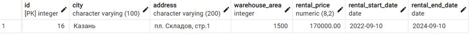

```
INSERT INTO products_in_warehouses
	(product_id, warehouse_id, quantity)
VALUES
	(100, 15, 20);
```

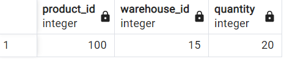

```
INSERT INTO worker
	(id, salary, working_email_address, personal_data_id, warehouse_id)
VALUES
	(31, 25000.00, 'FeDcBa@mail.ru', 100, 15);
```

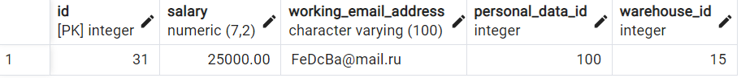

- Изменение значения нескольких полей у всех записей, отвечающих заданному условию, с помощью оператора UPDATE

```
SELECT * FROM worker WHERE warehouse_id = 15;
```

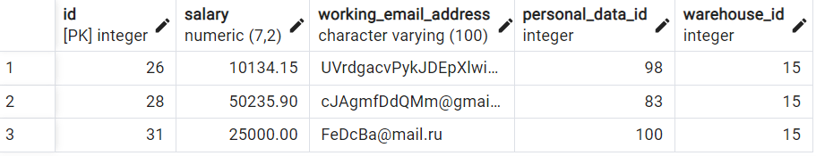

Для всех сотрудников, работающих на складе с id = 15, зарплата была поднята на 10000.

```
UPDATE worker SET salary = salary + 10000.00
	WHERE warehouse_id = 15;

SELECT * FROM worker WHERE warehouse_id = 15;
```

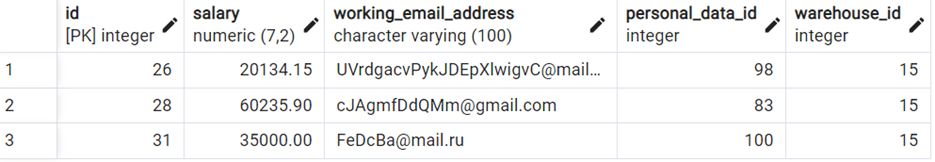

- Удаление записи, имеющей максимальное значение некоторой совокупной характеристики, с помощью оператора DELETE

```
INSERT INTO warehouse
	(id, city, address, warehouse_area, rental_price, rental_start_date, rental_end_date)
VALUES
	(17, 'Санкт-Петербург', 'ул. Первая, стр.10', 300, 900000.00, '2021-08-10', '2023-08-10');

SELECT id, address, warehouse_area, rental_price,
	rental_price / warehouse_area as price_per_unit_area_of_warehouse
		FROM warehouse WHERE city LIKE '%Санкт-Петербург%';
```

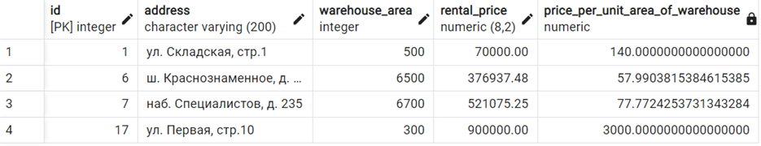

В таблицу складов была добавлена ещё одна запись. Для складов в Санкт-Петербурге была посчитана price_per_unit_area_of_warehouse - цена за аренду единицы площади склада.

В качестве совокупной характеристики был выбран поиск максимального значения price_per_unit_area_of_warehouse для складов в Санкт-Петербурге. Соответствующая этому значению запись была удалена.

```
DELETE FROM warehouse
	WHERE city LIKE '%Санкт-Петербург%' AND rental_price / warehouse_area = (
		SELECT MAX(rental_price / warehouse_area) as price_per_unit_area_of_warehouse
			FROM warehouse WHERE city LIKE '%Санкт-Петербург%');

SELECT id, address, warehouse_area, rental_price,
	rental_price / warehouse_area as price_per_unit_area_of_warehouse
		FROM warehouse WHERE city LIKE '%Санкт-Петербург%';
```

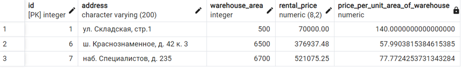

- Удаление записей в главной таблице, на которые не ссылается подчиненная таблица (используя вложенный запрос), с помощью оператора DELETE

```
SELECT * FROM vendor;
```

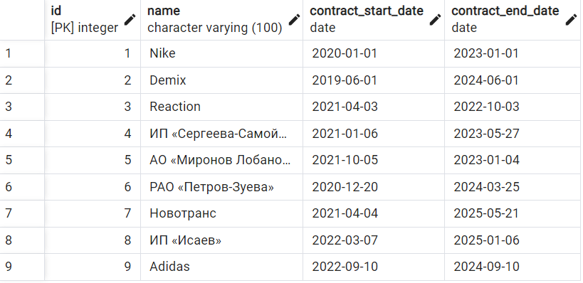

Последний производитель был добавлен в таблицу недавно, поэтому ещё нет товаров, которые бы ссылались на него, что позволяет безболезненно произвести удаление записи, соответствующей данному производителю.

```
DELETE FROM vendor WHERE vendor.id NOT IN (SELECT vendor_id FROM product);

SELECT * FROM vendor;
```

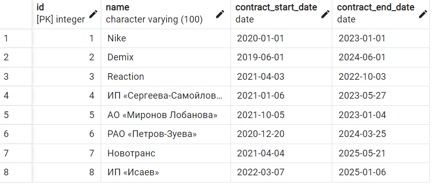

# Индивидуальное задание

**1. Вывести рейтинг покупателей (ФИО, наличие скидочной карты) по суммарной стоимости приобретенных ими товаров.**

Для того чтобы получить требуемую выборку данных, был написан запрос, содержащий в себе несколько подзапросов, вложенных друг в друга. Так изначально было необходимо подсчитать сумарную стоимость всех товаров в корзине покупателя, потом сложить стоимости всех корзин заказов покупателя, и затем найти персональные данные соответствующие покупателю.

```
SELECT first_name, last_name, discount_card, customer_sum FROM customer
	INNER JOIN (
		SELECT customer.id, SUM(products_sum_in_cart) as customer_sum FROM customer
			INNER JOIN cart ON cart.customer_id = customer.id
			INNER JOIN (
				SELECT cart.id, SUM(retail_price * p_in_c.quantity) as products_sum_in_cart FROM cart
					INNER JOIN products_in_carts as p_in_c ON p_in_c.cart_id = cart.id
					INNER JOIN product ON product.id = p_in_c.product_id
						GROUP BY cart.id
			) carts_sum ON carts_sum.id=cart.id
				GROUP BY customer.id
	) customers_sum ON customers_sum.id = customer.id
	INNER JOIN personal_data ON personal_data.id = customer.personal_data_id
		ORDER BY customer_sum DESC;
```

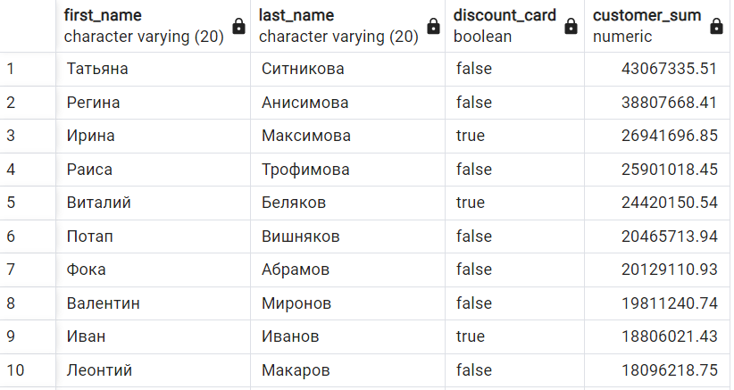

Для того чтобы убедиться в правильности написанного запроса, подзапросы входящие в него были выполнены отдельно.

Следующий запрос выводит товары, пристуствующие в корзине с идентификатором = 74, и их количество.

```
SELECT cart_id, product_id, retail_price, p_in_c.quantity FROM cart
	INNER JOIN products_in_carts as p_in_c ON p_in_c.cart_id = cart.id
	INNER JOIN product ON product.id = p_in_c.product_id
		WHERE cart_id = 74;
```

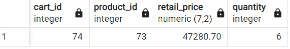

Следующий запрос выводит суммарную стоимость товаров в корзинах для всех корзин. В правильности данного подсчёта можно убедиться изпользуя результаты полученные для корзины с идентификатором = 74 в предыдущем запросе: 47280.70 * 6 = 283648.20

```
SELECT cart.id as cart_id, SUM(retail_price * p_in_c.quantity) as products_sum_in_cart FROM cart
	INNER JOIN products_in_carts as p_in_c ON p_in_c.cart_id = cart.id
	INNER JOIN product ON product.id = p_in_c.product_id
		GROUP BY cart.id;
```


Следующий запрос выводит суммарную стоимость всех корзин покупателя для всех покупателей.

```
SELECT customer.id as customer_id, SUM(products_sum_in_cart) as customer_sum FROM customer
	INNER JOIN cart ON cart.customer_id = customer.id
	INNER JOIN (
		SELECT cart.id, SUM(retail_price * p_in_c.quantity) as products_sum_in_cart FROM cart
			INNER JOIN products_in_carts as p_in_c ON p_in_c.cart_id = cart.id
			INNER JOIN product ON product.id = p_in_c.product_id
				GROUP BY cart.id
	) carts_sum ON carts_sum.id=cart.id
		GROUP BY customer.id;
```

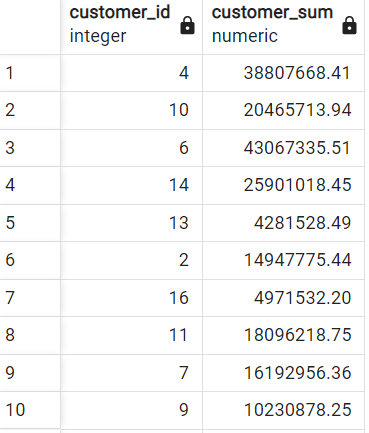

**2. Вывести таблицу с финансовыми показателями торговой сети по месяцам за предыдущий год: выручка, затраты на покупку товаров у поставщиков, затраты на аренду, прибыль.**

Так как в задании сказано, что необходимо в том числе подсчитать затраты на покупку товаров у поставщиков, в таблицу products_in_stores, содержащую информацию о том, в каких магазинах какие есть товары и в каком количестве, был добавлен атрибут purchase_date, в котором для каждого товара, имеющегося в магазине, случайным образом была сгенерирована дата покупки данного товара у поставщика.

```
ALTER TABLE products_in_stores
	ADD COLUMN purchase_date DATE;
	
UPDATE products_in_stores
	SET purchase_date = current_date - CAST (random() * 600 AS INTEGER);
```

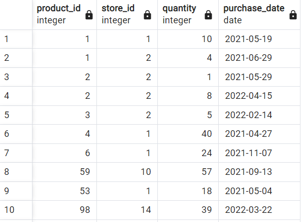

Аналогичным образом атрибут purchase_date был довален в таблицу products_in_warehouses, содержащую информацию о том, на каких складах какие есть товары и в каком количестве.

```
ALTER TABLE products_in_warehouses
	ADD COLUMN purchase_date DATE;
	
UPDATE products_in_warehouses
	SET purchase_date = current_date - CAST (random() * 600 AS INTEGER);
```

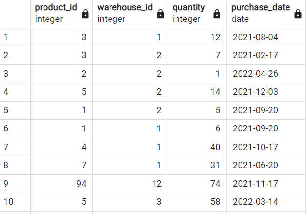

Для сбора финансовых показателей торговой сети по месяцам за предыдущий год была создана таблица **analytics**, содержащая следующие атрибуты: номер месяца, выручка, затраты на покупку товаров у поставщиков, затраты на аренду магазинов, затраты на аренду складов, прибыль.

```
CREATE TABLE analytics (
	month_number INTEGER NOT NULL PRIMARY KEY,
	income NUMERIC(14, 2),
	products_purchase NUMERIC(14, 2),
	stores_rent NUMERIC(14, 2),
	warehouses_rent NUMERIC(14, 2),
	profit NUMERIC(14, 2)
);

INSERT INTO analytics (month_number, income, products_purchase, stores_rent, warehouses_rent, profit)
	SELECT i, 0.0, 0.0, 0.0, 0.0, 0.0 FROM generate_series(1, 12) AS i;
```

Для заполнения столбца **income** таблицы **analytics**, в котором вычисляется суммарное количество денег заработанное с продажи товаров в данном месяце, был написан следующий запрос:

```
UPDATE analytics
SET income = month_sums_of_orders.month_sum
FROM (
	SELECT order_month, SUM(products_sum_in_cart) as month_sum FROM (
		SELECT products_sum_in_cart, EXTRACT(MONTH FROM order_date) as order_month FROM cart
			INNER JOIN (
				SELECT cart.id, SUM(retail_price * p_in_c.quantity) as products_sum_in_cart FROM cart
					INNER JOIN products_in_carts as p_in_c ON p_in_c.cart_id = cart.id
					INNER JOIN product ON product.id = p_in_c.product_id
						GROUP BY cart.id
			) carts_sum ON carts_sum.id=cart.id
			WHERE order_date BETWEEN '2021-01-01' AND '2021-12-31'
	) q GROUP BY order_month
) as month_sums_of_orders
WHERE month_number = order_month;
```

Для того чтобы убедиться в правильности данного запроса, отдельно были выполнены подзапросы в него входящие.

В данном запросе была получена суммарная стоимость товаров в корзинах для всех корзин заказов за 2021, также в отдельном атрибуте указывается месяц, в котором был совершена данная покупка.

```
SELECT cart.id as cart_id, products_sum_in_cart, EXTRACT(MONTH FROM order_date) as order_month FROM cart
	INNER JOIN (
		SELECT cart.id, SUM(retail_price * p_in_c.quantity) as products_sum_in_cart FROM cart
			INNER JOIN products_in_carts as p_in_c ON p_in_c.cart_id = cart.id
			INNER JOIN product ON product.id = p_in_c.product_id
				GROUP BY cart.id
	) carts_sum ON carts_sum.id=cart.id
	WHERE order_date BETWEEN '2021-01-01' AND '2021-12-31';
```

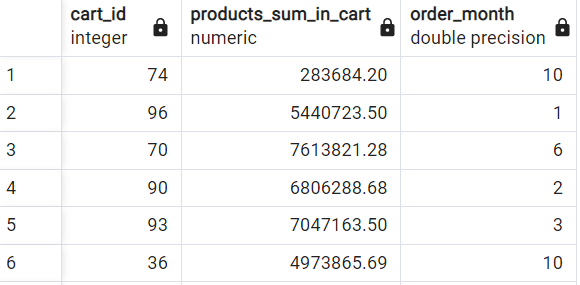

Данные полученные из предыдущего запроса используются для того, чтобы мы можно была вычислить суммарную стоимость всех заказов выполненых в конкретном месяце 2021 года, именно эта информация идёт в столбец **income** таблицы **analytics**.

```
SELECT order_month, SUM(products_sum_in_cart) as month_sum FROM (
	SELECT products_sum_in_cart, EXTRACT(MONTH FROM order_date) as order_month FROM cart
		INNER JOIN (
			SELECT cart.id, SUM(retail_price * p_in_c.quantity) as products_sum_in_cart FROM cart
				INNER JOIN products_in_carts as p_in_c ON p_in_c.cart_id = cart.id
				INNER JOIN product ON product.id = p_in_c.product_id
					GROUP BY cart.id
		) carts_sum ON carts_sum.id=cart.id
		WHERE order_date BETWEEN '2021-01-01' AND '2021-12-31'
) q GROUP BY order_month;
```

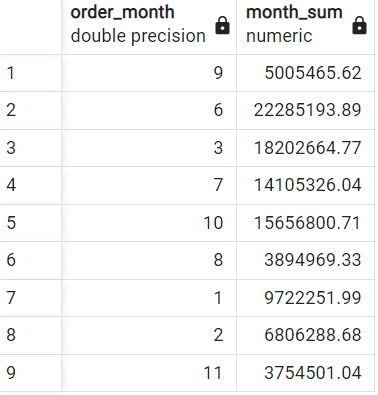

Следующим был заполнен столбец **products_purchase** таблицы **analytics**, в котором содержатся затраты на покупку товаров у поставщиков:

```
UPDATE analytics
SET products_purchase = month_purchases_for_stores.stores_sums
FROM (
	SELECT EXTRACT(MONTH FROM p_in_s.purchase_date) as purchase_month, 
	SUM(purchase_price * p_in_s.quantity) as stores_sums FROM store
		INNER JOIN products_in_stores as p_in_s ON p_in_s.store_id = store.id
		INNER JOIN product ON product.id = p_in_s.product_id
		WHERE p_in_s.purchase_date BETWEEN '2021-01-01' AND '2021-12-31'
			GROUP BY purchase_month
) as month_purchases_for_stores
WHERE month_number = purchase_month;
```

Было вычислено суммарное количество денег потраченное на покупку товаров у поставщиков для магазинов в конкретном месяце 2021 года.

```
SELECT EXTRACT(MONTH FROM p_in_s.purchase_date) as purchase_month, 
SUM(purchase_price * p_in_s.quantity) as stores_sums FROM store
	INNER JOIN products_in_stores as p_in_s ON p_in_s.store_id = store.id
	INNER JOIN product ON product.id = p_in_s.product_id
	WHERE p_in_s.purchase_date BETWEEN '2021-01-01' AND '2021-12-31'
		GROUP BY purchase_month;
```

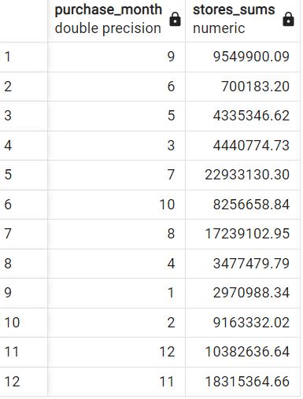

Также к полученным значениям затрат на покупку товаров у поставщиков для магазинов были прибавлены затраты на покупку товаров у поставщиков для складов:

```
UPDATE analytics
SET products_purchase = products_purchase + month_purchases_for_warehouses.warehouses_sums
FROM (
	SELECT EXTRACT(MONTH FROM p_in_w.purchase_date) as purchase_month, 
	SUM(purchase_price * p_in_w.quantity) as warehouses_sums FROM warehouse
		INNER JOIN products_in_warehouses as p_in_w ON p_in_w.warehouse_id = warehouse.id
		INNER JOIN product ON product.id = p_in_w.product_id
		WHERE p_in_w.purchase_date BETWEEN '2021-01-01' AND '2021-12-31'
			GROUP BY purchase_month
) as month_purchases_for_warehouses
WHERE month_number = purchase_month;
```

Было вычислено суммарное количество денег потраченное на покупку товаров у поставщиков для складов в конкретном месяце 2021 года.

```
SELECT EXTRACT(MONTH FROM p_in_w.purchase_date) as purchase_month, 
SUM(purchase_price * p_in_w.quantity) as warehouses_sums FROM warehouse
	INNER JOIN products_in_warehouses as p_in_w ON p_in_w.warehouse_id = warehouse.id
	INNER JOIN product ON product.id = p_in_w.product_id
	WHERE p_in_w.purchase_date BETWEEN '2021-01-01' AND '2021-12-31'
		GROUP BY purchase_month;
```


Следующим был заполнен столбец **stores_rent** таблицы **analytics**, в котором содержатся затраты на аренду магазинов:

```
UPDATE analytics
SET stores_rent = (SELECT SUM(rental_price) FROM store
	WHERE rental_start_date <= '2021-01-31' AND rental_end_date >= '2021-01-01')
		WHERE month_number = 1;
		
UPDATE analytics
SET stores_rent = (SELECT SUM(rental_price) FROM store
	WHERE rental_start_date <= '2021-02-28' AND rental_end_date >= '2021-02-01')
		WHERE month_number = 2;

UPDATE analytics
SET stores_rent = (SELECT SUM(rental_price) FROM store
	WHERE rental_start_date <= '2021-03-31' AND rental_end_date >= '2021-03-01')
		WHERE month_number = 3;

UPDATE analytics
SET stores_rent = (SELECT SUM(rental_price) FROM store
	WHERE rental_start_date <= '2021-04-30' AND rental_end_date >= '2021-04-01')
		WHERE month_number = 4;
		
UPDATE analytics
SET stores_rent = (SELECT SUM(rental_price) FROM store
	WHERE rental_start_date <= '2021-05-31' AND rental_end_date >= '2021-05-01')
		WHERE month_number = 5;

UPDATE analytics
SET stores_rent = (SELECT SUM(rental_price) FROM store
	WHERE rental_start_date <= '2021-06-30' AND rental_end_date >= '2021-06-01')
		WHERE month_number = 6;

UPDATE analytics
SET stores_rent = (SELECT SUM(rental_price) FROM store
	WHERE rental_start_date <= '2021-07-31' AND rental_end_date >= '2021-07-01')
		WHERE month_number = 7;
		
UPDATE analytics
SET stores_rent = (SELECT SUM(rental_price) FROM store
	WHERE rental_start_date <= '2021-08-31' AND rental_end_date >= '2021-08-01')
		WHERE month_number = 8;

UPDATE analytics
SET stores_rent = (SELECT SUM(rental_price) FROM store
	WHERE rental_start_date <= '2021-09-30' AND rental_end_date >= '2021-09-01')
		WHERE month_number = 9;

UPDATE analytics
SET stores_rent = (SELECT SUM(rental_price) FROM store
	WHERE rental_start_date <= '2021-10-31' AND rental_end_date >= '2021-10-01')
		WHERE month_number = 10;
		
UPDATE analytics
SET stores_rent = (SELECT SUM(rental_price) FROM store
	WHERE rental_start_date <= '2021-11-30' AND rental_end_date >= '2021-11-01')
		WHERE month_number = 11;

UPDATE analytics
SET stores_rent = (SELECT SUM(rental_price) FROM store
	WHERE rental_start_date <= '2021-12-31' AND rental_end_date >= '2021-12-01')
		WHERE month_number = 12;
```

В данном случае значение для каждого месяц было необходимо считать отдельно, так как важно учесть, что в течение месяца могут быть подписаны контракты с новыми магазинами, а также для некоторых магазинов в текущим месяце конкракты могут заканчиваться. Различие результатов для запросов, возвращающих список магазинов, с которыми имеется действующий контракт, в январе и в июне наглядно это демонстрирует.

```
SELECT id, rental_price, rental_start_date, rental_end_date FROM store
	WHERE rental_start_date <= '2021-01-31' AND rental_end_date >= '2021-01-01';
```

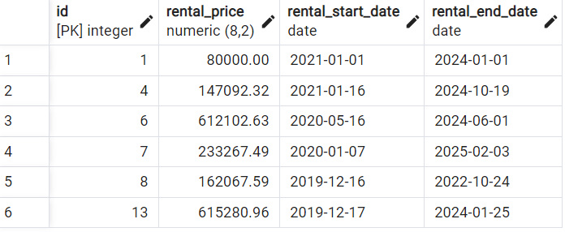

```
SELECT id, rental_price, rental_start_date, rental_end_date FROM store
	WHERE rental_start_date <= '2021-06-30' AND rental_end_date >= '2021-06-01';
```

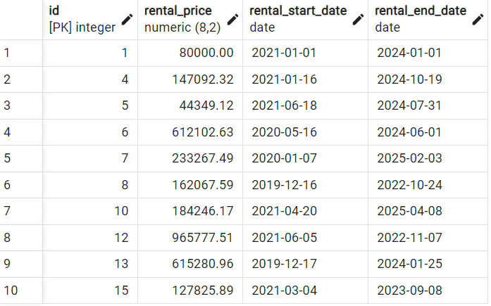

Аналогичным образом был заполнен столбец **warehouses_rent** таблицы **analytics**, в котором содержатся затраты на аренду складов:

```
UPDATE analytics
SET warehouses_rent = (SELECT SUM(rental_price) FROM warehouse
	WHERE rental_start_date <= '2021-01-31' AND rental_end_date >= '2021-01-01')
		WHERE month_number = 1;
		
UPDATE analytics
SET warehouses_rent = (SELECT SUM(rental_price) FROM warehouse
	WHERE rental_start_date <= '2021-02-28' AND rental_end_date >= '2021-02-01')
		WHERE month_number = 2;

UPDATE analytics
SET warehouses_rent = (SELECT SUM(rental_price) FROM warehouse
	WHERE rental_start_date <= '2021-03-31' AND rental_end_date >= '2021-03-01')
		WHERE month_number = 3;

UPDATE analytics
SET warehouses_rent = (SELECT SUM(rental_price) FROM warehouse
	WHERE rental_start_date <= '2021-04-30' AND rental_end_date >= '2021-04-01')
		WHERE month_number = 4;
		
UPDATE analytics
SET warehouses_rent = (SELECT SUM(rental_price) FROM warehouse
	WHERE rental_start_date <= '2021-05-31' AND rental_end_date >= '2021-05-01')
		WHERE month_number = 5;

UPDATE analytics
SET warehouses_rent = (SELECT SUM(rental_price) FROM warehouse
	WHERE rental_start_date <= '2021-06-30' AND rental_end_date >= '2021-06-01')
		WHERE month_number = 6;

UPDATE analytics
SET warehouses_rent = (SELECT SUM(rental_price) FROM warehouse
	WHERE rental_start_date <= '2021-07-31' AND rental_end_date >= '2021-07-01')
		WHERE month_number = 7;
		
UPDATE analytics
SET warehouses_rent = (SELECT SUM(rental_price) FROM warehouse
	WHERE rental_start_date <= '2021-08-31' AND rental_end_date >= '2021-08-01')
		WHERE month_number = 8;

UPDATE analytics
SET warehouses_rent = (SELECT SUM(rental_price) FROM warehouse
	WHERE rental_start_date <= '2021-09-30' AND rental_end_date >= '2021-09-01')
		WHERE month_number = 9;

UPDATE analytics
SET warehouses_rent = (SELECT SUM(rental_price) FROM warehouse
	WHERE rental_start_date <= '2021-10-31' AND rental_end_date >= '2021-10-01')
		WHERE month_number = 10;
		
UPDATE analytics
SET warehouses_rent = (SELECT SUM(rental_price) FROM warehouse
	WHERE rental_start_date <= '2021-11-30' AND rental_end_date >= '2021-11-01')
		WHERE month_number = 11;

UPDATE analytics
SET warehouses_rent = (SELECT SUM(rental_price) FROM warehouse
	WHERE rental_start_date <= '2021-12-31' AND rental_end_date >= '2021-12-01')
		WHERE month_number = 12;
```

Ситуация со складами аналогична ситуации с магазинами: в течение месяца могут быть подписаны контракты с новыми складами, а также для некоторых складов в текущим месяце конкракты могут заканчиваться. Различие результатов для запросов, возвращающих список складов, с которыми имеется действующий контракт, в январе и в марте наглядно это демонстрирует.

```
SELECT id, rental_price, rental_start_date, rental_end_date FROM warehouse
	WHERE rental_start_date <= '2021-01-31' AND rental_end_date >= '2021-01-01';
```

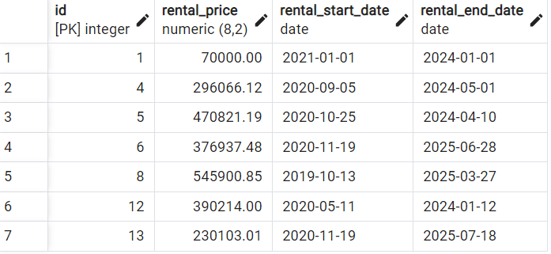

```
SELECT id, rental_price, rental_start_date, rental_end_date FROM warehouse
	WHERE rental_start_date <= '2021-03-31' AND rental_end_date >= '2021-03-01';
```

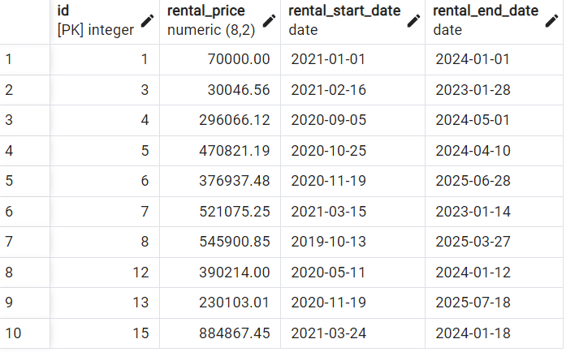

Последним был заполнен столбец **profit** таблицы **analytics**, в котором содержится прибыль. Для её получения из выручки вычитаются все затраты.

```
UPDATE analytics
SET profit = income - products_purchase - stores_rent - warehouses_rent;
```

Следующий запрос выводит уже заполненую таблицу **analytics**, в которой пристуствуют все финансовые показатели торговой сети по месяцам за предыдущий год: выручка, затраты на покупку товаров у поставщиков, затраты на аренду магазинов, затраты на аренду складов, прибыль.

```
SELECT * FROM analytics;
```

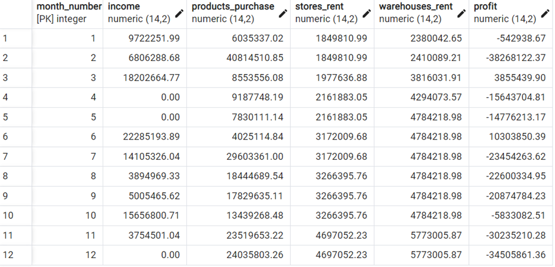

Стоит отметить, что прибыльными для данной торговой сети в 2021 году были лишь два месяца из двенадцати, а суммарный убыток за год составил 192575225.68

```
SELECT SUM(profit) as profit FROM analytics;
```

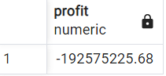

**3. Написать хранимую процедуру/функцию, которая повышает на 10% цену продажи товаров, имеющих рейтинг более 4,5.**

Изначально был написан запрос, который позволяет вычислить средний рейтинг всех товаров присутствующих в корзинах заказов, после чего были выбраны товары, имеющие рейтинг более 4.5. Перед этим была отдельно создана новая БД - струтктурно она не отличается от оригинальной БД, но при её создании был использован немного изменённый generator.py из lab2, для того чтобы среди товаров гарантировано были товары с рейтингом более 4.5.

```
SELECT product_id, AVG(rating) as avg_rating FROM cart
	INNER JOIN products_in_carts ON products_in_carts.cart_id = cart.id
		GROUP BY product_id
			HAVING AVG(rating) > 4.5
```

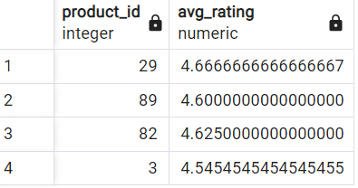

Был написан запрос, который выводит цену этих товаров. В данном случае это цена продажи товаров до того как к ним была применена функция, которая повышает эту цену на 10%.

```
SELECT product.id, retail_price FROM (
	SELECT product_id, AVG(rating) as avg_rating FROM cart
		INNER JOIN products_in_carts ON products_in_carts.cart_id = cart.id
			GROUP BY product_id
				HAVING AVG(rating) > 4.5
) as products_with_high_rating 
	INNER JOIN product ON product.id = products_with_high_rating.product_id;
```

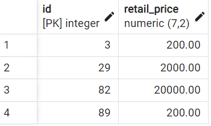

Была написана функция price_increase(), которая повышает на 10% цену продажи товаров, имеющих рейтинг более 4,5.

```
CREATE OR REPLACE FUNCTION price_increase() RETURNS void AS $$
BEGIN
	UPDATE product
	SET retail_price = retail_price * 1.1
		WHERE product.id IN (
			SELECT product_id FROM cart
				INNER JOIN products_in_carts ON products_in_carts.cart_id = cart.id
					GROUP BY product_id
						HAVING AVG(rating) > 4.5
		);
END;
$$ LANGUAGE plpgsql;

SELECT * FROM price_increase();
```

Вновь был написан запрос, выводящий цену товаров. Цены товаров с высоким рейтингом действительно повысились на 10%.

```
SELECT product.id, retail_price FROM (
	SELECT product_id, AVG(rating) as avg_rating FROM cart
		INNER JOIN products_in_carts ON products_in_carts.cart_id = cart.id
			GROUP BY product_id
				HAVING AVG(rating) > 4.5
) as products_with_high_rating 
	INNER JOIN product ON product.id = products_with_high_rating.product_id;
```

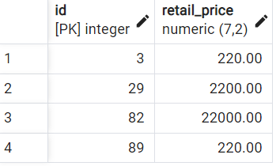

## Вывод
В ходе выполнения лабораторной работы были получены навыки работы с языком создания запросов управления данными SQL-DML. Для извлечения записей из таблиц был использован оператор SELECT. Для добавления записей был использован оператор INSERT. Для модификации записей был использован оператор UPDATE. Для удаления записей был использован оператор DELETE. Было выполнено индивидуальное задание.
